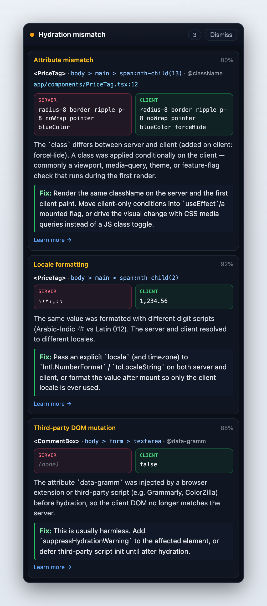
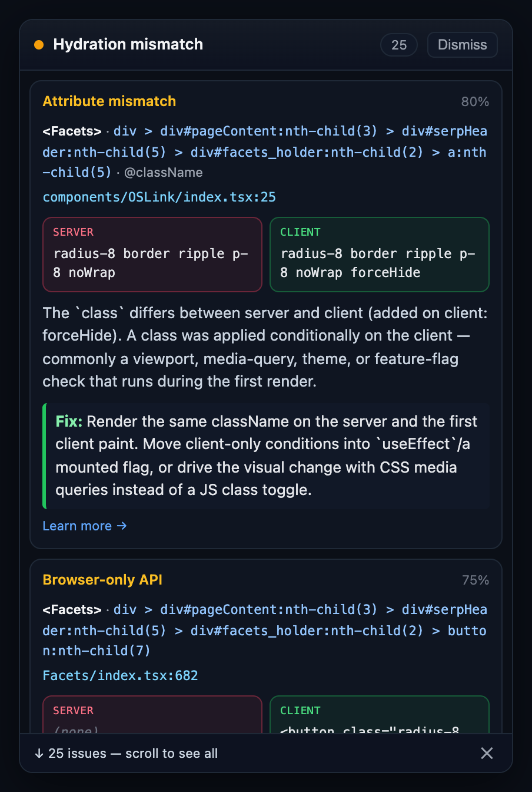
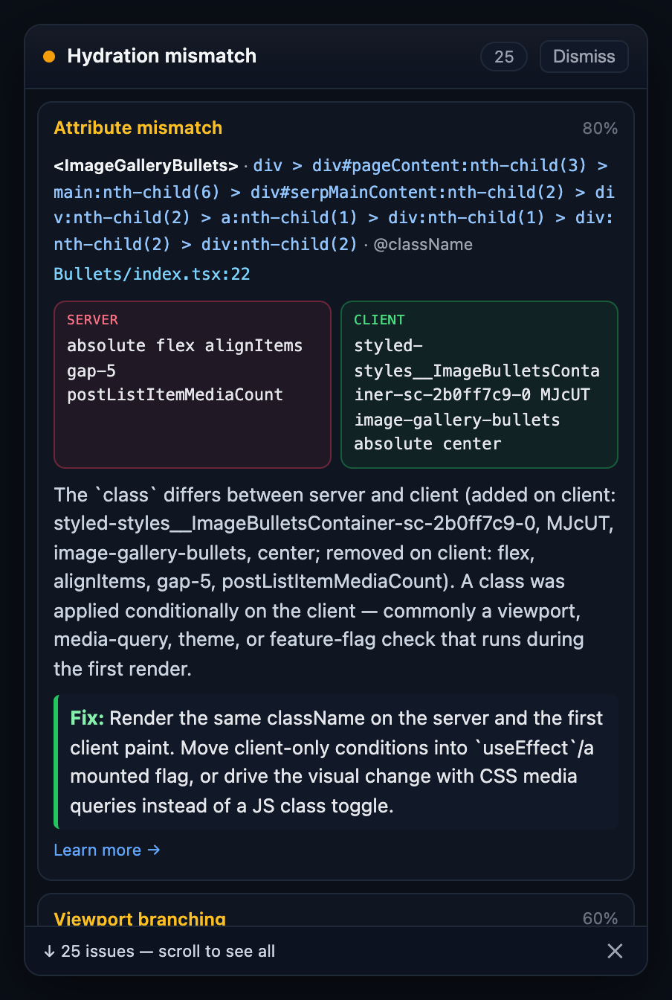
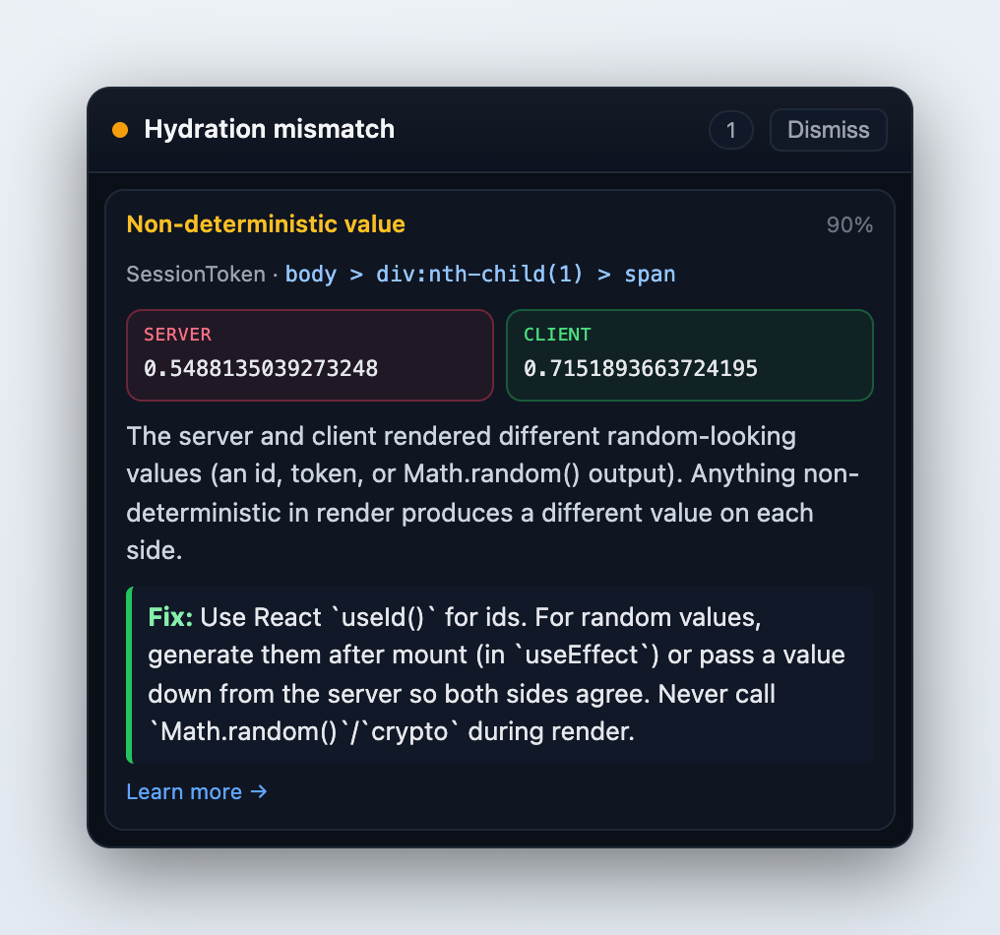
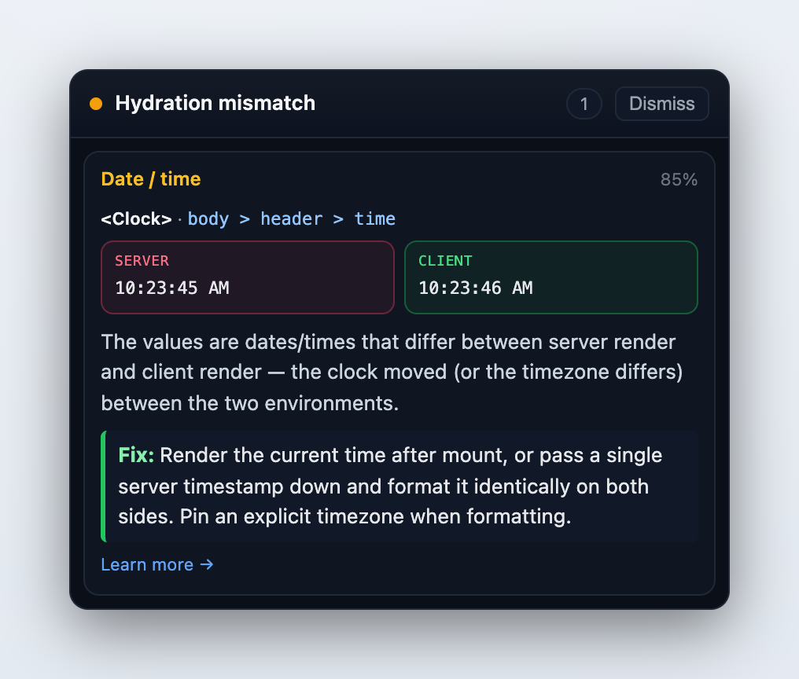
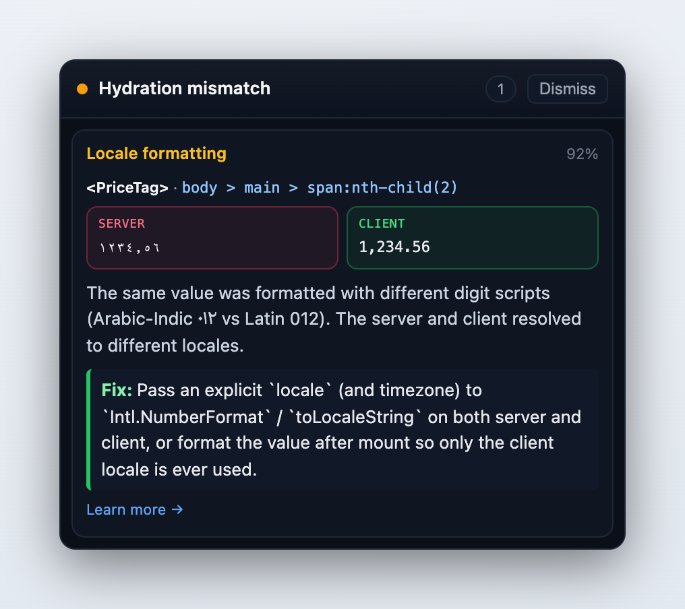
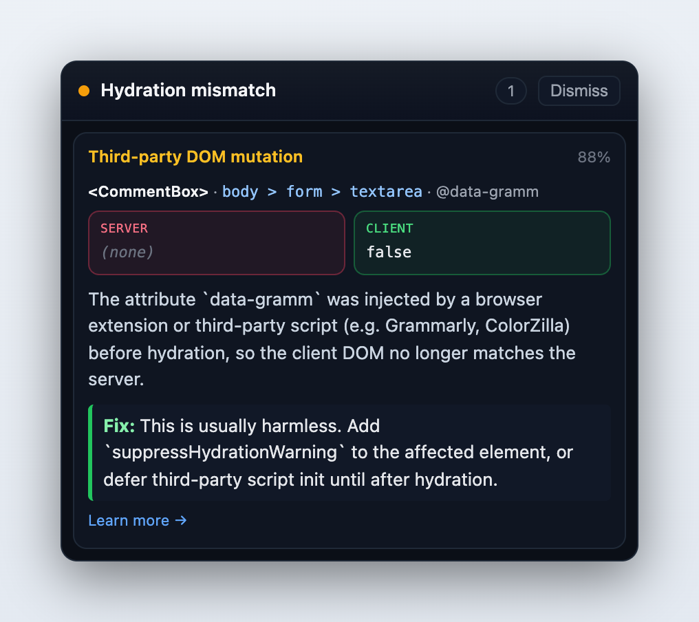
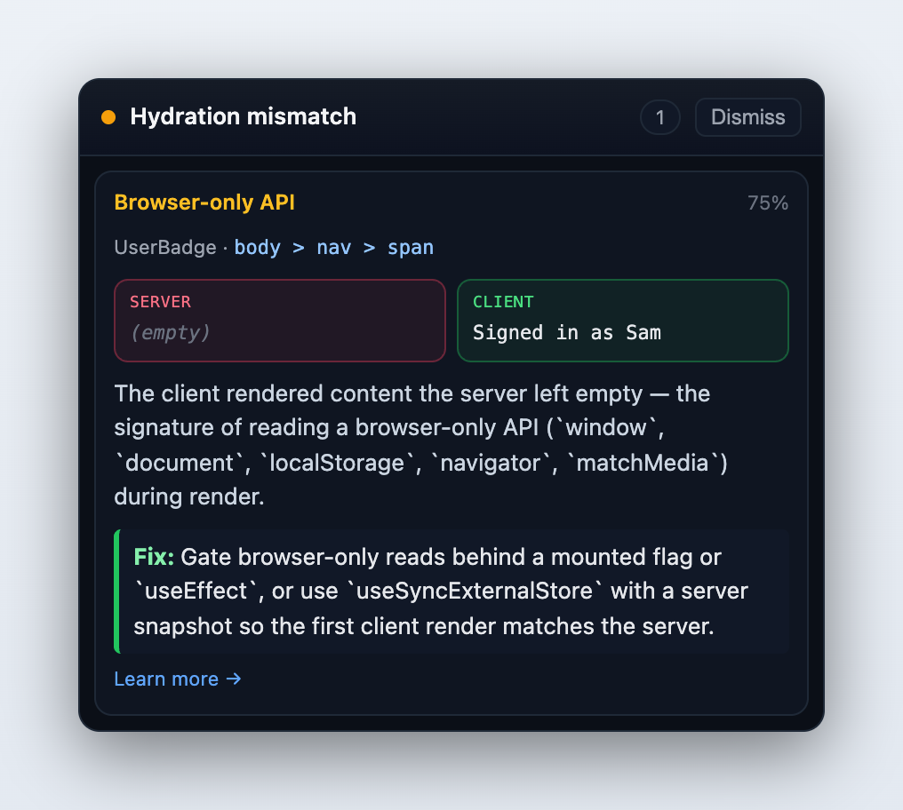
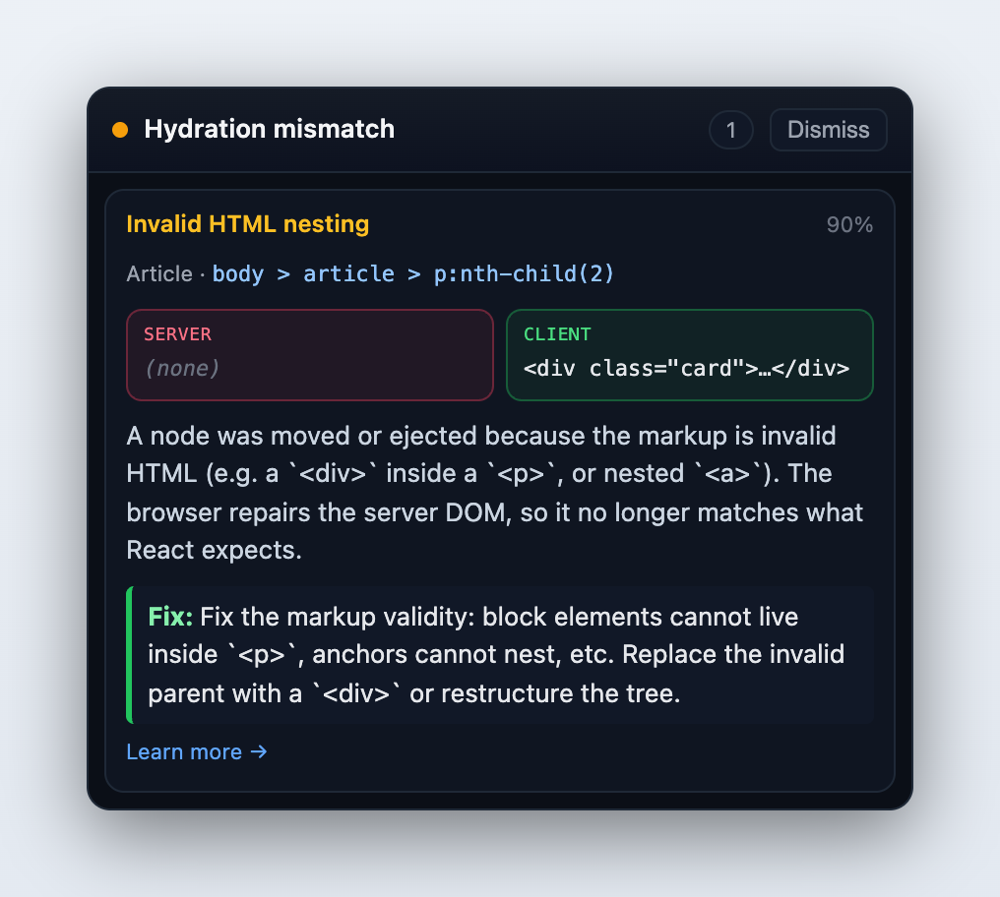
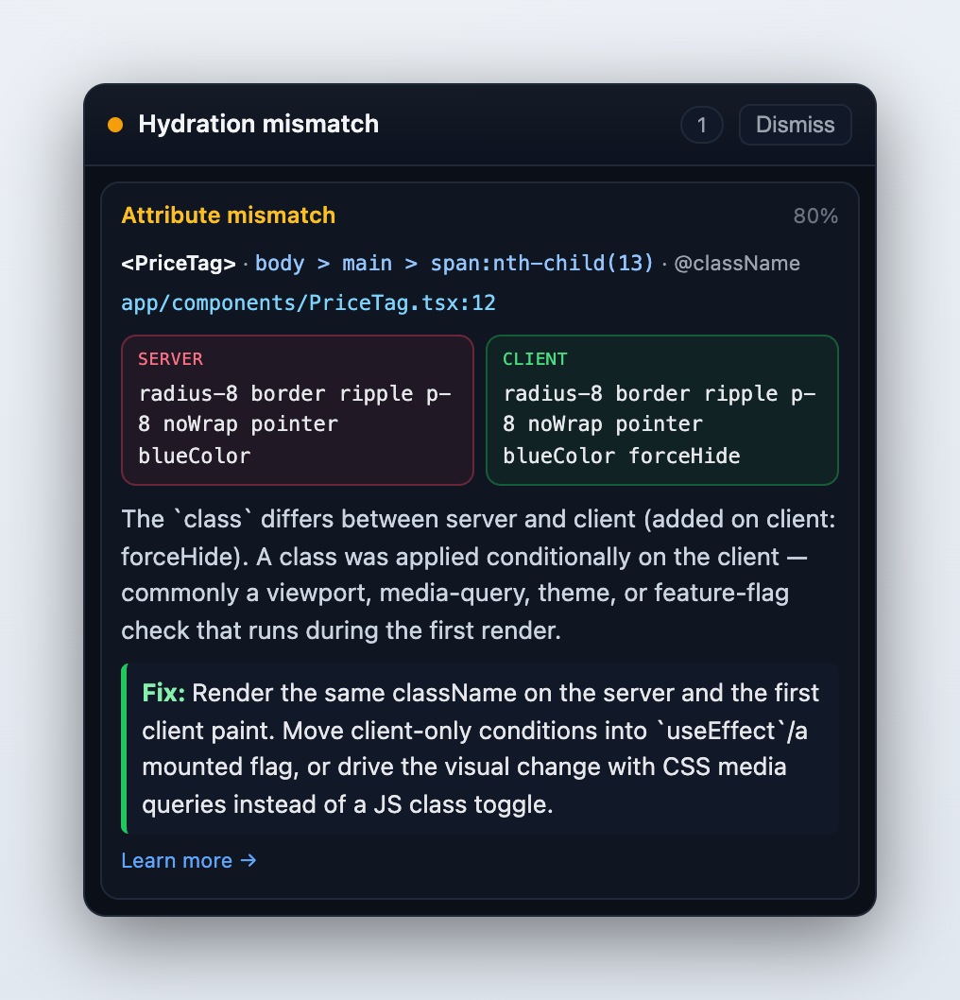

# why-hydration

[](https://www.npmjs.com/package/why-hydration)
[](https://www.npmjs.com/package/why-hydration)
[](https://bundlephobia.com/package/why-hydration)
[](LICENSE)

📦 **npm:** https://www.npmjs.com/package/why-hydration &nbsp;·&nbsp; 🐙 **GitHub:** https://github.com/razan-aboushi/why-hydration &nbsp;·&nbsp; 💼 **Author:** [Razan Aboushi](https://www.linkedin.com/in/razan-aboushi/)

**Tells you which component broke hydration, what differed, and how to fix it — in dev, with zero production cost.**

A **React hydration mismatch debugger** for **Next.js** (App Router & Pages
Router), **Vite**, **CRA**, **Remix**, and any React app that hydrates
server-rendered HTML. It points at the exact **component, source file/line,
and value** behind a hydration warning and explains the likely root cause and
the fix — instead of leaving you to bisect the tree by hand.

<p align="center">
  
</p>

React's own hydration warning tells you *that* something mismatched, and
sometimes prints a diff — but not which component owns it, not a plain-English
root cause, and not a fix. `why-hydration` captures the server-rendered HTML
before hydration, compares it against the live DOM and against React's own
warning, classifies the mismatch into a known cause, and reports all of that
together.

```text
▸ React:          Warning: Text content did not match. Server: "١٢٣٤" Client: "1234"

▸ why-hydration:  ⬡ locale-format (92%) — <PriceTag> · body > main > span:nth-child(2)
                  Server: ١٢٣٤   Client: 1234
                  Why:  Same value, different digit scripts (Arabic-Indic vs Latin).
                        The server and client resolved to different locales.
                  Fix:  Pass an explicit locale + timezone to Intl on both sides,
                        or format the value after mount.
```

> React's actual hydration warning format differs by version (some print an
> explicit `Server: … Client: …` message, newer versions print a JSX diff with
> `+`/`-` lines). `why-hydration` parses both.

- 🔍 **Where** — the **component name** (e.g. `<PriceTag>`) and, when
  available, its **source file:line**, read from React's own fiber tree and
  hydration diff, plus the DOM node's selector path.
- 🔀 **What** — the server-rendered value vs. the client-rendered value, side
  by side.
- 🧠 **Why** — the likely cause, classified into one of nine categories with a
  confidence score.
- 🛠️ **Fix** — a specific, actionable suggestion with a link to a fuller
  explanation.
- 📋 **All of them, once** — every mismatch on the page is collected and
  deduplicated, not just the first one found.
- 🧹 **Low noise** — skips DOM nodes injected by third-party scripts and
  browser extensions (ads, consent banners, chat widgets, Grammarly) and
  content inside a still-loading Suspense boundary, so you see *your* bug, not
  incidental page noise.
- 🌐 **Arabic-first locale detection** — digit-script mismatches (٠١٢ vs 012)
  are a first-class cause, not an afterthought.
- 🔤 **RTL-safe overlay** — the overlay always renders left-to-right, even on
  pages with `<html dir="rtl">`, since its content (paths, values, code) is
  English.
- 🫧 **Zero production cost** — every code path is gated behind
  `process.env.NODE_ENV`, and CI fails the build if the production bundle for
  any entry point isn't tree-shaken to a no-op.

Output goes to an in-browser **overlay**, a grouped **console** message, and
an **`onReport`** callback so you can pipe reports to your own logging.
Supports **React 18 and 19**.

---

## Table of contents

- [Install](#install)
- [Quick setup](#quick-setup)
- [What is a hydration mismatch](#what-is-a-hydration-mismatch)
- [What why-hydration detects](#what-why-hydration-detects)
- [How detection works](#how-detection-works)
- [What you will see](#what-you-will-see)
- [RTL and Arabic support](#rtl-and-arabic-support)
- [Detection scope](#detection-scope)
- [Options and API](#options-and-api)
- [Report structure](#report-structure)
- [Cause categories](#cause-categories)
- [Production behavior](#production-behavior)
- [Privacy and performance](#privacy-and-performance)
- [Troubleshooting](#troubleshooting)
- [Contributing](#contributing)
- [License](#license)

---

## Install

```bash
npm install --save-dev why-hydration
```

`react` and `react-dom` are peer dependencies (`^18.0.0 || ^19.0.0`). The
package has **zero runtime dependencies** of its own. Building from source
requires Node.js 18+; the published package has no Node-version requirement of
its own beyond what your framework already needs.

---

## Quick setup

Pick the setup that matches how your app hydrates. In every case:
`<HydrationInspector>` (or `createHydrationInspector`) starts detection, and a
snapshot script must run **before** hydration so the server-rendered HTML can
be compared against it. Skipping the snapshot script still works — detection
falls back to parsing React's own warning — but you lose the precise DOM-level
diff for attribute and text mismatches that the DOM path can catch.

### Next.js App Router

```tsx
// app/layout.tsx
import { HydrationSnapshotScript } from 'why-hydration/next/script';
import { HydrationInspector } from 'why-hydration/next';

export default function RootLayout({ children }: { children: React.ReactNode }) {
  return (
    <html>
      <head>
        {process.env.NODE_ENV !== 'production' && <HydrationSnapshotScript />}
      </head>
      <body>
        <HydrationInspector>{children}</HydrationInspector>
      </body>
    </html>
  );
}
```

### Next.js Pages Router

```tsx
// pages/_document.tsx  → inside <Head>
import { HydrationSnapshotScript } from 'why-hydration/next/script';
// ...
<Head>{process.env.NODE_ENV !== 'production' && <HydrationSnapshotScript />}</Head>

// pages/_app.tsx
import { HydrationInspector } from 'why-hydration/next';
export default function App({ Component, pageProps }) {
  return (
    <HydrationInspector>
      <Component {...pageProps} />
    </HydrationInspector>
  );
}
```

### Vite, CRA, Remix, and custom `hydrateRoot`

Use this path for any setup where **you** call `hydrateRoot` — the tool wires
into React's `onRecoverableError` hook for richer detection context.

```tsx
import { hydrateRoot } from 'react-dom/client';
import { createHydrationInspector } from 'why-hydration/react';

const inspector = createHydrationInspector();

hydrateRoot(
  document.getElementById('root')!,
  <inspector.Provider>
    <App />
  </inspector.Provider>,
  { onRecoverableError: inspector.onRecoverableError },
);
```

Add the snapshot script to your HTML `<head>`, before your entry `<script>`
(e.g. Vite's `index.html`):

```html
<head>
  <!-- why-hydration snapshot — dev only, runs before hydration -->
  <script>
    (function () {
      var K = '__WHY_HYDRATION_SNAPSHOT__';
      if (typeof window === 'undefined' || window[K]) return;
      var S = ['#root'];
      function cap() {
        if (window[K]) return;
        var r = {};
        for (var i = 0; i < S.length; i++) {
          var el = document.querySelector(S[i]);
          if (el) r[S[i]] = el.innerHTML;
        }
        window[K] = { version: 1, capturedAt: Date.now(), roots: r };
      }
      if (document.readyState !== 'loading') cap();
      else {
        document.addEventListener('readystatechange', function () {
          if (document.readyState === 'interactive') cap();
        });
        document.addEventListener('DOMContentLoaded', cap);
      }
    })();
  </script>
</head>
```

> Prefer to generate that script rather than copy-paste it?
> `import { getSnapshotScriptSource } from 'why-hydration'` returns exactly
> that string, so you can inject it from your own build tooling and pass a
> custom list of root selectors.

Runnable examples for a Next.js App Router setup and a Vite setup live in
[`examples/`](examples).

---

## What is a hydration mismatch

Server-side rendering (SSR) generates HTML on the server and sends it to the
browser, which the browser paints immediately. React then **hydrates** that
HTML: it re-renders the same component tree on the client and attaches event
handlers to the *existing* DOM nodes instead of replacing them, on the
assumption that the client render produces the exact same markup the server
sent.

A **hydration mismatch** happens when that assumption is false — the client's
first render produces different text, a different attribute value, or a
different tree shape than what the server sent. Common root causes are values
that are non-deterministic (`Math.random()`, `Date.now()`), values that depend
on the browser environment (`window`, `localStorage`, viewport width) but not
on the server, or formatting that differs because the server and client
resolved a different locale or timezone. React logs a warning to the console
when it detects this and, depending on what mismatched, may or may not repair
the DOM to match. `why-hydration` exists to make that warning actionable.

---

## What why-hydration detects

For every hydration mismatch on the page, `why-hydration` reports:

- **Where** — the component name (best-effort, from React's fiber tree) and
  its source file/line when your build includes that debug information, plus
  a CSS-selector-style path to the DOM node.
- **What** — the server-rendered value and the client-rendered value, shown
  side by side, whether that's text content, an attribute (including `class`
  and `style`, which React does not patch into the live DOM — see
  [How detection works](#how-detection-works)), or a structural change
  (a node added, removed, or swapped).
- **Why** — the mismatch classified into one of the [cause categories](#cause-categories)
  below, with a confidence score, or `unknown` if no rule matches.
- **The fix** — a specific, actionable suggestion, plus a link to a fuller
  explanation for that category.

It collects **every** mismatch found on a page load, deduplicates identical
ones, and reports them together rather than one at a time across repeated
refreshes.

It also actively avoids reporting things that are not your bug: DOM nodes
injected by third-party scripts or browser extensions after the server
render (ad frames, consent banners, analytics/chat widgets, Grammarly),
content inside a Suspense boundary that is still loading on the server, and
React/Next.js's own internal markup markers.

---

## How detection works

1. **Snapshot.** A tiny inline script (`<HydrationSnapshotScript>`, or the
   manual `<script>` for non-Next setups) captures each hydration root's
   server-rendered `innerHTML` before hydration runs — specifically at the
   point `document.readyState` becomes `"interactive"`, which happens before
   deferred scripts execute.
2. **Detect.** Two signals run together: a dev-only `console.error`
   interceptor recognizes React's own hydration warnings and works in every
   setup, including Next.js, where you don't call `hydrateRoot` yourself; and
   `onRecoverableError`, which you wire up manually when you do own
   `hydrateRoot` (Vite/CRA/Remix), adds the component stack React captured
   for the mismatch.
3. **Diff.** Once hydration has settled — the engine re-checks a few times
   over roughly 1.5 seconds, because React can apply corrected values to a
   mismatched subtree slightly after the initial commit — it walks the frozen
   server snapshot against the live DOM. Children are aligned with a
   longest-common-subsequence match (not by index), so a node injected
   mid-tree by a third-party script doesn't shift the comparison and
   misattribute every following sibling. This is a bounded check, not a
   standing `MutationObserver`, so legitimate DOM changes from your app's own
   state updates after this window are never mistaken for a hydration issue.

   The passes are also bounded in cost. React logs its warnings in bursts, so
   every signal that lands in the same frame is coalesced into **one** diff
   rather than one diff each, and the captured server markup — re-materialising
   it is a full HTML parse of your server render — is parsed **once per root**
   and reused across every pass. Scheduling races an animation frame against a
   50 ms timer, so a page that is hidden at load (where the browser suspends
   `requestAnimationFrame` entirely) still gets inspected.
4. **Classify.** Each divergence is passed through an ordered list of rules
   (see [Cause categories](#cause-categories)); the first rule whose
   confidence clears the threshold wins, otherwise the mismatch is reported as
   `unknown`. Custom rules passed via the `classify` option run before the
   built-in ones.
5. **Locate.** For mismatches the DOM diff found, the component name and
   source location are read from the live DOM node's React fiber. `class` and
   `style` mismatches are only visible in React's own warning — React
   reconciles them silently without patching the DOM — so those are parsed
   from the warning text instead, including the component name printed there.
6. **Report.** Every unique mismatch (deduplicated by kind, attribute,
   category, and value — not by DOM path, so the same logical mismatch found
   via two signals is reported once) is sent to the overlay, a grouped console
   message, and your `onReport` callback, up to `maxReports` (default 25).

---

## What you will see

When a mismatch is detected in dev, you get up to three things (all inert in
production):

1. **An in-page overlay** — a dismissible panel in the corner of the screen
   with one card per mismatch: category, confidence, server vs. client
   values, a plain-English explanation, and the fix. The panel scrolls when
   there are more mismatches than fit, with a "scroll to see all" hint.
2. **A grouped console message** — the same information, formatted for easy
   copy-paste into an issue or chat.
3. **Your `onReport` callback**, if you passed one — the full structured
   `HydrationReport` object for each mismatch.

A page with no mismatches renders **nothing** — no overlay, no console output.

### Controlling the overlay

| Action | Effect |
| ------ | ------ |
| **Dismiss** button, or **Esc** | Removes the panel for the rest of the page load. |
| **✕** on the hint bar | Closes just the "scroll to see all" hint; the panel stays. |
| `overlay={false}` | Never mounts it at all — `onReport` and the console output still work. |
| `overlay={{ position }}` | `bottom-right` (default), `bottom-left`, `top-right`, `top-left`. |

The overlay is a *view* over the collected reports, not the collector itself:
dismissing it does not stop detection, and `onReport` keeps firing. If a
mismatch is found after you dismissed it — a late signal, or a second hydration
error — the panel returns showing that mismatch, starting from a clean count
rather than resuming a stale one.

It renders in an isolated Shadow DOM, is never part of your app's tree, and is
excluded from its own diff, so it can never be mistaken for a mismatch.
Mismatched values are rendered as **text**, and "Learn more" links are
restricted to `http(s)` URLs, so nothing in a mismatched value can inject markup
or script into the panel.

### In a real app

Captured from a production Next.js app: every mismatch on the page collected
together, each with its component and source location, and a scroll hint when
there are more than fit:

<p align="center">
  
  &nbsp;&nbsp;
  
</p>

---

## RTL and Arabic support

An Arabic app gets the same diagnosis quality as an English one. That covers
both how the overlay renders and what the engine can actually detect.

### The overlay

- The overlay's own layout **always renders left-to-right**, on any page. Its
  content — file paths, DOM selectors, code values, category names — is
  English, so keeping it LTR keeps it readable regardless of the host page's
  direction.
- This is automatic and needs no configuration. The overlay lives in an
  isolated Shadow DOM, sets `direction: ltr` on both `:host` and the panel, and
  carries a `dir="ltr"` attribute as well — belt and braces, because the CSS
  `all` shorthand deliberately excludes `direction` (per spec), so
  `:host { all: initial }` alone would still let `direction: rtl` leak in and
  flip the server/client diff columns.
- Values are rendered as **text**, so Arabic, Hebrew and mixed bidi content
  display intact inside the LTR panel without reordering the surrounding
  layout.

### Detection

Detection is direction-agnostic: every rule matches on the *shape* of a value,
not its script. Three Arabic-specific cases are worth calling out, because the
first is the one most people expect and the other two are the ones that
actually bite:

- **Different digit scripts.** Arabic-Indic `٠١٢` on one side, Latin `012` on
  the other — the classic symptom of `Intl`/`toLocaleString` resolving to a
  different locale on the server than in the browser. Reported as
  [`locale-format`](#cause-locale-format) at 92% confidence.
- **Same digit script, different formatting.** An Arabic-first app renders
  Arabic-Indic digits on *both* sides, so there is no script difference to key
  off — only a grouping separator (`١٬٤٠٠` vs `١٤٠٠`), a decimal separator
  (`١٢٣٤٫٥٦` vs `١٢٣٤.٥٦`), a field order, or a time. These are folded to Latin
  before the numeric/date shape tests run, so they are classified exactly like
  their English equivalents instead of falling through to `unknown`. Persian /
  Extended Arabic-Indic digits (`۰۱۲`) are handled the same way.
- **Invisible bidi marks.** `Intl` wraps numbers and date fields in
  bidirectional control characters (LRM, RLM, ALM, isolates) in RTL locales,
  and *which* ones it emits differs between ICU versions — so Node and the
  browser routinely format the same date into strings that are visually
  identical and byte-different. This is the hardest hydration mismatch to debug
  by eye, since the console diff looks like the same text twice. It is detected
  and named explicitly.

Both directions are covered by the test suite as a matched pair
(`test/i18n.test.tsx`), plus overlay directionality in `test/direction.test.ts`,
so English and Arabic behaviour cannot drift apart.

---

## Detection scope

Hydration mismatches can only happen during the **initial server render and
hydration** of a page — a full page load, a browser refresh, or a direct URL
visit to a server-rendered route. `why-hydration` detects those.

**Client-side navigation** (Next.js `<Link>` / `router.push`, React Router,
etc.) does not re-hydrate the destination page — it is rendered entirely on
the client, so there is no server HTML for it to diverge from, and no
hydration mismatch can occur there. This is how React's hydration model works,
not a limitation of this tool. To check a specific route, load it directly or
refresh it.

---

## Options and API

### `<HydrationInspector>`

Wrap your app (or, for Next.js, use the `why-hydration/next` re-export).

```tsx
<HydrationInspector
  overlay             // boolean | OverlayOptions   (default: true — shown in dev)
  onReport={(report) => sendToLogging(report)}
  ignore={['.grammarly-ext', (node) => node.hasAttribute('data-safe')]}
  classify={[myCustomRule]}   // extra classifiers, run before the built-ins
  maxReports={25}
>
  {children}
</HydrationInspector>
```

| Option       | Type                                           | Default       | Description                                             |
| ------------ | ----------------------------------------------- | ------------- | --------------------------------------------------------- |
| `overlay`    | `boolean \| OverlayOptions`                     | `true` in dev | The in-browser panel. Pass `false` to disable it entirely, or an `OverlayOptions` object to configure it. |
| `onReport`   | `(report: HydrationReport) => void`             | –             | Called once per unique report.                             |
| `ignore`     | `Array<string \| (node: Element) => boolean>`   | `[]`          | Suppress known-safe mismatches by CSS selector or predicate, matched against the live DOM node. |
| `classify`   | `Classifier[]`                                  | `[]`          | Custom classification rules, run **before** the built-in ones. |
| `maxReports` | `number`                                        | `25`          | Cap on the number of unique reports collected per page load. |

### `createHydrationInspector(options)`

For Vite/CRA/Remix, where you call `hydrateRoot` yourself. Accepts the same
options as `<HydrationInspector>`, plus:

| Option  | Type       | Default                                             | Description |
| ------- | ---------- | ---------------------------------------------------- | ----------- |
| `roots` | `string[]` | the selectors captured by the snapshot, or `['#root', '#__next', 'body']` | Override which root selectors are diffed against the snapshot. |

Returns:

```ts
interface HydrationInspectorHandle {
  onRecoverableError: (error: unknown, info?: { componentStack?: string }) => void;
  Provider: (props: { children?: React.ReactNode }) => React.ReactElement;
}
```

`Provider` owns the inspector's lifetime: it must actually be mounted, and
unmounting it tears the inspector down (overlay removed, `console.error`
handed back untouched). Mounting it again restarts detection cleanly rather
than stacking a second overlay or a second console patch — which is what makes
it safe under `<React.StrictMode>`, where React deliberately runs every mount
effect setup → cleanup → setup.

### `OverlayOptions`

```ts
interface OverlayOptions {
  position?: 'bottom-right' | 'bottom-left' | 'top-right' | 'top-left'; // default 'bottom-right'
}
```

### `<HydrationSnapshotScript>`

```ts
interface HydrationSnapshotScriptProps {
  selectors?: string[]; // default ['#root', '#__next', 'body']
  nonce?: string;        // forwarded to the inline <script>, for a CSP nonce
}
```

Renders `null` outside development.

### Core engine (`why-hydration`)

The framework-agnostic entry (`import ... from 'why-hydration'`) exposes the
diff engine, classifier, and report collector directly — useful if you're
building a custom integration or writing a custom `classify` rule. See
[`src/index.ts`](src/index.ts) for the full export list, including `classify`,
`ReportCollector`, `diffSnapshotAgainstDom`, and the `Classifier` type.

---

## Report structure

```ts
interface HydrationReport {
  id: string;
  timestamp: number;
  component?: string;           // best-effort component name, e.g. "PriceTag"
  componentStack?: string;      // from onRecoverableError, when available
  location?: {
    file?: string;
    line?: number;
    column?: number;
  };
  node: {
    path: string;                // CSS-selector-style path to the DOM node
    tagName?: string;
    attribute?: string;          // set for attribute mismatches
    kind: 'text' | 'attribute' | 'structure' | 'node-added' | 'node-removed';
  };
  server: string | null;
  client: string | null;
  cause: {
    category: HydrationCauseCategory; // one of the categories below, or "unknown"
    confidence: number;               // 0–1
    explanation: string;
    suggestion: string;
    docsUrl?: string;
  };
  raw?: { reactMessage?: string };   // the original React console message, if any
}
```

---

## Cause categories

The classifier runs the rules below **in this exact order**; the first rule
whose confidence clears the threshold (0.5) wins, otherwise the mismatch is
reported as `unknown`. Custom rules passed via the `classify` option run
before all of these.

> **What is the "Learn more →" link?** Every report (overlay and console)
> carries a `docsUrl` that deep-links to the matching section below (e.g. the
> locale-format report links to [`#cause-locale-format`](#cause-locale-format)).

<a id="cause-non-deterministic-value"></a>

### non-deterministic-value



Server and client rendered different random-looking values (UUID, token, React
`:r…:` id, or `Math.random()` output).
**Fix:** `useId()` for ids; generate randomness after mount; never call
`Math.random()`/`crypto` in render.
**Reference:** [React `useId()`](https://react.dev/reference/react/useId).

<a id="cause-date-time"></a>

### date-time



Values are dates/times that differ by a small delta — the clock or timezone
moved between server and client render.

Matched on **shape**, not on whether `Date.parse` happens to accept the value:
ISO dates, `D/M/YYYY`-style dates, clock times, month names with a number, and
10–13 digit epoch timestamps. That distinction matters because `Date.parse` is
extremely permissive — it reads `100` as the year 100 and `server-0` as the
year 2000 — so an ordinary price, count, or id would otherwise be diagnosed as
a clock drift.

**Fix:** render time after mount, or pass one server timestamp down and pin
the timezone when formatting.
**Reference:** [React — different client/server content](https://react.dev/reference/react-dom/client/hydrateRoot#handling-different-client-and-server-content).

<a id="cause-locale-format"></a>

### locale-format



Same underlying value, different formatting. Covers:

- **Different digit scripts** — Arabic-Indic `٠١٢` vs Latin `012`, or Persian
  `۰۱۲` vs Latin.
- **Different separators or field order** — `1,234.56` vs `1.234,56`,
  `١٬٤٠٠` vs `١٤٠٠`, MM/DD vs DD/MM. Detected in Arabic-Indic and Persian
  digits as well as Latin, so an app that renders the same digit script on both
  sides is still diagnosed.
- **Invisible bidirectional marks** — values that are identical on screen but
  differ by LRM/RLM/ALM or isolate characters, which `Intl` adds around numbers
  and dates in RTL locales and which different ICU versions (Node vs the
  browser) emit differently.

**Fix:** pass an explicit `locale` and timezone to `Intl` on both sides, or
format after mount. See also [RTL and Arabic support](#rtl-and-arabic-support).
**Reference:** [MDN `Intl.NumberFormat`](https://developer.mozilla.org/en-US/docs/Web/JavaScript/Reference/Global_Objects/Intl/NumberFormat).

<a id="cause-third-party-dom-mutation"></a>

### third-party-dom-mutation



Either an attribute was injected by a browser extension (Grammarly, ColorZilla,
…) or an early third-party script before hydration, or an entire node — an ad
iframe, a consent banner, an analytics or chat widget — was mounted by a
third-party script after the server render.
**Fix:** usually harmless. Add `suppressHydrationWarning` to the affected
element or its nearest server-rendered wrapper, or defer third-party script
initialization until after hydration (e.g. Next.js's
`<Script strategy="afterInteractive">`).
**Reference:** [React `suppressHydrationWarning`](https://react.dev/reference/react-dom/components/common#suppressing-unavoidable-hydration-mismatch-errors).

<a id="cause-browser-only-api"></a>

### browser-only-api



The client rendered content the server left empty — the signature of reading
`window`, `document`, `localStorage`, `navigator`, or `matchMedia` during
render.
**Fix:** gate behind a mounted flag or `useEffect`, or use
`useSyncExternalStore` with a server snapshot.
**Reference:** [React `useSyncExternalStore` (server rendering)](https://react.dev/reference/react/useSyncExternalStore#adding-support-for-server-rendering).

<a id="cause-viewport-branching"></a>

### viewport-branching

A whole subtree was added, removed, or swapped — typically a JavaScript width
or viewport check that branches the tree at first render.
**Fix:** switch with CSS media queries at first paint instead of branching in
JavaScript.
**Reference:** [MDN — CSS media queries](https://developer.mozilla.org/en-US/docs/Web/CSS/CSS_media_queries/Using_media_queries).

<a id="cause-invalid-html-nesting"></a>

### invalid-html-nesting



A node was moved or ejected because the markup is invalid HTML (e.g. a `<div>`
inside a `<p>`, or a nested `<a>`). The browser repairs the server-rendered DOM
so it no longer matches what React expects.
**Fix:** correct the markup validity — block elements cannot live inside
`<p>`, anchors cannot nest, etc.
**Reference:** [MDN — `<p>` (permitted content)](https://developer.mozilla.org/en-US/docs/Web/HTML/Element/p).

<a id="cause-whitespace-minification"></a>

### whitespace-minification

The mismatch is whitespace-only — the text is identical apart from
spaces/newlines. An HTML minifier likely collapsed whitespace around the
hydration root differently from React.
**Fix:** check your minifier settings (e.g. `conservativeCollapse`) around the
app root.
**Reference:** [React — text content hydration](https://react.dev/reference/react-dom/client/hydrateRoot#handling-different-client-and-server-content).

<a id="cause-attribute-mismatch"></a>

### attribute-mismatch



A `class`, `style`, or other attribute differs between server and client —
the report lists the exact tokens (e.g. *added on client: `forceHide`*).
Usually a class or style applied by a client-only conditional (viewport,
media query, theme, or feature flag) during the first render. React does
**not** patch mismatched attributes into the live DOM, so `why-hydration`
reads these from React's own hydration warning.
**Fix:** render the same attribute value on the server and the first client
paint — move the client-only condition into `useEffect`/a mounted flag, or
drive the visual change with a CSS media query instead of a JS class toggle.
**Reference:** [React — different client/server content](https://react.dev/reference/react-dom/client/hydrateRoot#handling-different-client-and-server-content).

<a id="cause-unknown"></a>

### unknown

A mismatch was detected but didn't match any of the rules above. The report
still shows the exact server vs. client values and node path so you can
diagnose it directly.
**Fix:** compare the two values — the cause is usually one of the categories
above. If you find a reliable signal for it, add a custom rule via the
`classify` option (see [Contributing](#contributing)).
**Reference:** [React — hydration mismatch errors](https://react.dev/reference/react-dom/client/hydrateRoot#handling-different-client-and-server-content).

---

## Production behavior

`why-hydration` is designed to cost **nothing** in a production build:

- Every code path — the overlay, the diff engine, the classifier, the console
  interceptor — is gated behind an inline `process.env.NODE_ENV !== 'production'`
  check, written so bundlers can statically fold it away. In a production
  build, `<HydrationInspector>` becomes a plain pass-through and
  `createHydrationInspector()` returns no-op functions.
- Production is **opt-out**, not opt-in: the internal dev check treats an
  explicit `NODE_ENV === 'production'` as production and everything else,
  including a bundle where `process` was never defined at all, as development.
  That matters because Vite, Rollup and esbuild substitute
  `process.env.NODE_ENV` without shimming `process` itself — requiring
  `process` to exist would silently disable the inspector for all of them. It
  cannot leak dev code into a production bundle, because the entry-point gates
  above have already been folded away by then.
- This is enforced, not just claimed: the project's CI pipeline runs a size
  budget (`npm run size`) against a real production bundle built with webpack
  and terser — the same toolchain Next.js and CRA use for production — and
  fails the build if the tree-shaken output for any entry point isn't reduced
  to a near-empty stub. Verified independently against Rollup, which is what
  Vite uses for production builds: **99 B** under webpack, **166 B** under
  Rollup, versus ~40 KB for the same entry built for development.
- `<HydrationSnapshotScript>` also renders `null` outside development, so no
  snapshot script is emitted into your production HTML.

---

## Privacy and performance

- **Read-only.** The tool never modifies your application's DOM. It only
  appends its own overlay container (isolated inside a Shadow DOM) and reads
  the pre-hydration snapshot.
- **No dependency on your app's React instance for the overlay.** The overlay
  is rendered with plain DOM APIs, so it still works even while your app's
  React tree is mid-recovery from an error.
- **Server-safe.** Detection logic — including the `console.error`
  interceptor — only runs in the browser (guarded by a `typeof window`
  check), so nothing runs, and nothing patches `console`, during
  server-side rendering.
- **No network requests, no telemetry, no runtime dependencies.** Nothing
  leaves the browser. `react`/`react-dom` are peer dependencies; the package
  itself has zero runtime dependencies. Reports go only to the in-page
  overlay, your browser console, and your own `onReport` callback if you
  provide one.
- **Values are rendered as text**, never interpreted as HTML, and the
  overlay's "Learn more" links are restricted to `http(s)` URLs — so content
  from a mismatched value cannot be used to inject markup or script into the
  overlay.
- **Bounded, not continuous.** Detection re-checks the DOM a handful of times
  in the ~1.5 seconds after hydration and then stops — there is no standing
  `MutationObserver` watching your app for the rest of its lifetime.
- **Bounded in cost, too.** A burst of React warnings landing in one frame
  triggers one diff pass, not one per warning. The captured server markup is
  parsed once per root and reused across passes rather than re-parsed each
  time. Retained warning text is capped, so an app erroring in a render loop
  cannot grow the per-pass cost without limit, and reports are capped by
  `maxReports` (default 25).
- **Symmetrical teardown.** Unmounting the inspector restores `console.error`
  to exactly the function it replaced, removes the overlay, and clears every
  pending timer — so a remount (including React Strict Mode's deliberate
  double-mount in dev) leaves one overlay and one console patch, not two.

---

## Troubleshooting

**Does it work outside Next.js?** Yes — anywhere React hydrates: Vite, CRA,
Remix, or a custom SSR setup. Use `createHydrationInspector` where you own
`hydrateRoot`, or `<HydrationInspector>` plus the snapshot script otherwise.
The core engine (`why-hydration`) is framework-agnostic.

**Nothing shows up, but I know there's a mismatch.** Confirm `NODE_ENV` isn't
`production`, that `<HydrationInspector>` (or its `Provider`) is actually
**mounted** and wraps the part of the tree that mismatches, and that the
snapshot script is present in `<head>` and runs before your app's hydration
script. Without the snapshot script, the tool still reports mismatches it can
parse from React's own console warning, but loses the precise DOM-level diff.
If you passed `roots`, check the console for a
`[why-hydration] Skipping root:` warning — a root with no captured server HTML
can never produce a DOM-level report, and it says so rather than failing
silently.

**Does it work under `<React.StrictMode>`?** Yes. Strict Mode runs every mount
effect setup → cleanup → setup in development, which tears the inspector down
and rebuilds it. You get one overlay, one console patch, and each mismatch
reported once — the warnings React logged during the first pass are replayed
to the rebuilt inspector rather than lost.

**I loaded the page in a background tab and got nothing.** Fixed — browsers
suspend `requestAnimationFrame` on hidden pages, so scheduling races a frame
against a 50 ms timer and no longer depends on the page being painted.

**The "Learn more →" link 404s.** The links point at this README on GitHub
(`github.com/razan-aboushi/why-hydration#cause-…`). If you've forked the
package under a different name or repository, update `DOCS_BASE` in
`src/core/classify/rules.ts` and the `repository` field in `package.json` to
match your URL.

**Can I send reports to my own logging/monitoring?** Yes — pass `onReport`;
you receive the full `HydrationReport` object for every unique mismatch.

**Why do results show all mismatches at once and stay the same across
refreshes?** The diff aligns DOM children with a longest-common-subsequence
match rather than by index, so a node injected by a third-party script (a
toast, a portal, an ad) is treated as an insertion instead of shifting the
comparison for every following sibling — which is what used to cause
different, incomplete results on different refreshes.

**Does it slow my app down?** No measurable impact in dev, and none at all in
production. It's dev-only, runs a bounded diff across roughly 1.5 seconds
right after hydration, then stops.

**Does it work with `<html dir="rtl">`?** Yes — see
[RTL and Arabic support](#rtl-and-arabic-support). The overlay stays
left-to-right on purpose; this is not a bug. Detection covers Arabic-script
formatting mismatches on both sides, not just Arabic-vs-Latin.

**My Arabic app shows two identical-looking values as a mismatch.** They differ
by invisible bidirectional control characters — `Intl` adds LRM/RLM/isolate
marks around numbers and dates in RTL locales, and Node's ICU and the browser's
ICU do not always agree on which. The report names this explicitly under
[`locale-format`](#cause-locale-format). Format the value in one place and pass
the string down, or add `suppressHydrationWarning` if the marks are harmless.

---

## Contributing

Adding a cause category is a self-contained change — see
[CONTRIBUTING.md](CONTRIBUTING.md) for the project layout, how to add a
classifier rule, and the non-negotiables (zero production cost, read-only
DOM access).

---

## License

[MIT](LICENSE) © [Razan Aboushi](https://github.com/razan-aboushi)
